#### Mermaid cli
This is an excellent book on Mermaid:
https://pragprog.com/titles/apdiag/creating-software-with-modern-diagramming-techniques/
Ashley Peacock

https://github.com/mermaid-js/mermaid-cli
```bash
npm install -g @mermaid-js/mermaid-cli
```
The syntax is quite intuitive:
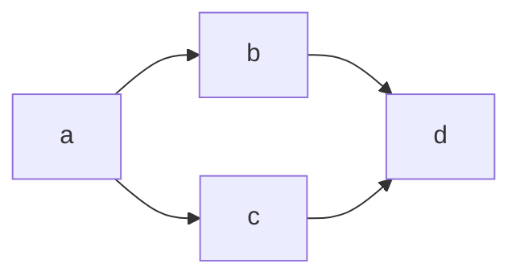
```mermaid
flowchart LR
    a --> b & c --> d
```
Interesting you can quote the mermaid directly in markdown. You can't do this with plantuml.


There is an intellij plugin which allows viewing the image. To extract the image you need to run:
```bash
mmdc -i mermaid.mmd -o mermaid.png
```

Creating a simple class diagram is quite easy:
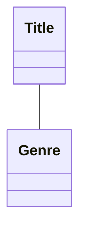
```mermaid
classDiagram
    Title -- Genre
```

The relation between Title and Genre is an association which is a loose link between two entities.
We can also show a closer bond with Title that of composition:
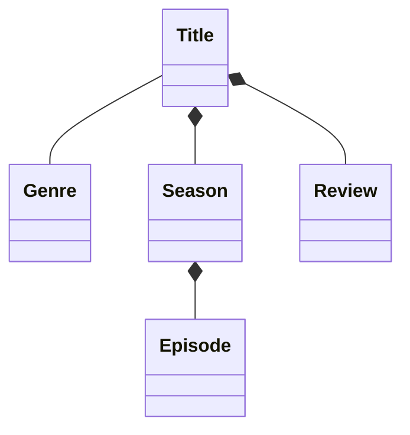
```mermaid
classDiagram
    Title -- Genre
    Title *-- Season
    Title *-- Review
    
    Season *-- Episode
```
We should put the parent on the left for easier readability. The season also has an episode which is also has a composite
relationship. This time between Episode and Season. We now know two relationship types:
- Associations: two entities that are loosely related and can exist independent of one another
- Compositions: two entities tightly related and cannot exist independently of one another

### Aggregate relationships
We can now start to think about Actors as they also provide important information about the Title.
This entity doesn't suite a composite relationship. Titles could exist without Actors and Titles without Actors.
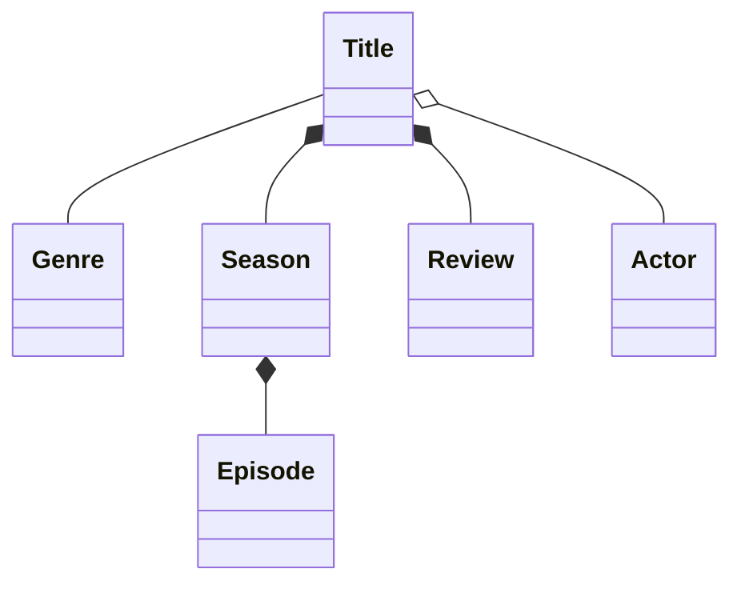
```mermaid
classDiagram
    Title -- Genre
    Title *-- Season
    Title *-- Review
    Title o-- Actor
    
    Season *-- Episode
```
The aggregate relationship between Actor and Title is an empty diamond. The bond between the Actor and Title is not
as strong as Season and Review so it is an aggregate relationship.

#### Associations

- Association: relationship between entities with at least one entity holding a reference to the other. 
There is no owner of the relationship and exist separately. For instance Teach and Student relationship.
- Aggregation: this is a direct relationship between entities. They do still exist independently of each other.
For instance, Teacher has an aggregate relationship to Class. You could delete the Teacher but the Class would
still remain and make sense on its own.
- Compositions: the closest relationship is reserved for compositions. Similarly to aggregations there is an owner
of the relationship. However if the parent is deleted the child must be deleted too. Grade is a composite relation to
Class. If Class were deleted the Grade wouldn't make sense unless it was linked to Class.

#### Movie Booker
We can now try to apply this to the MovieBooker domain:
https://github.dev/TomSpencerLondon/MovieBooker

We will try to improve this diagram as we progress.
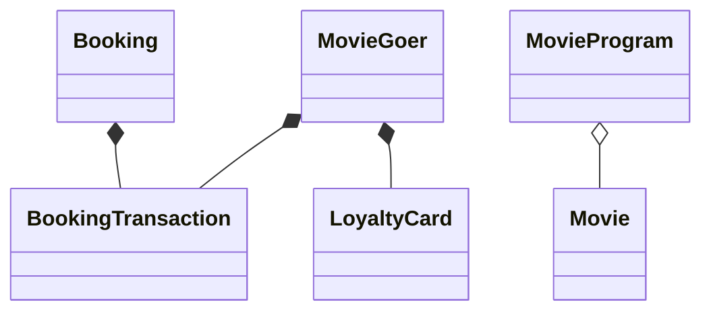
```mermaid
classDiagram
    Booking *-- BookingTransaction
    MovieGoer *-- BookingTransaction
    MovieGoer *-- LoyaltyCard
    MovieProgram o-- Movie
```

### Chapter 2 Enhance the Domain Model
We will now learn how to show inheritance in order to show subtypes and how to provide more information
to anyone viewing the diagram with descriptions and multiplicity.
We can now add the TVShow, Short and Film children to Title.

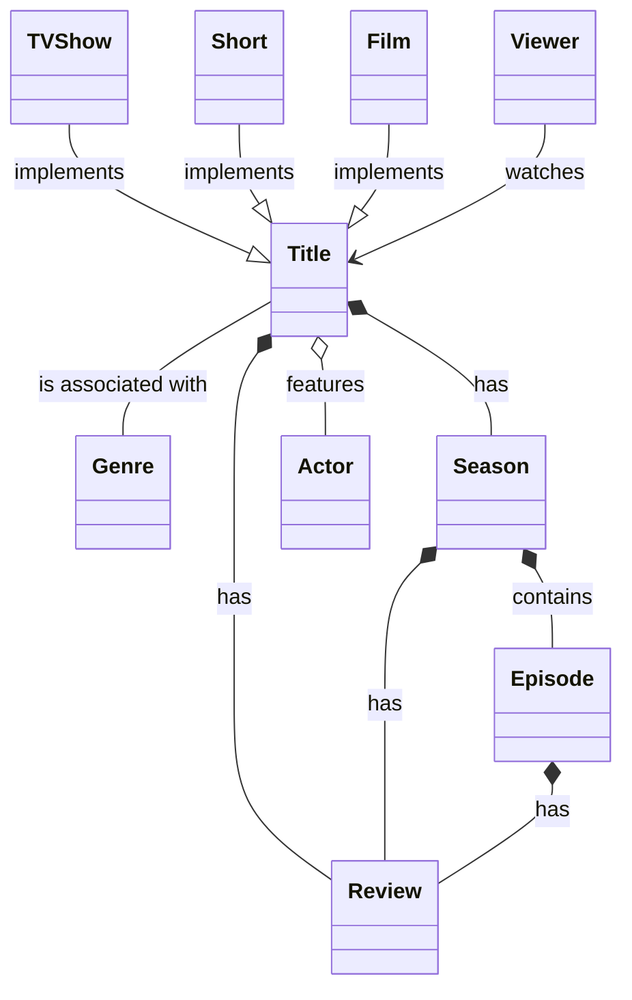
```mermaid
classDiagram
    Title -- Genre:is associated with
    Title *-- Season: has
    Title *-- Review: has
    Title o-- Actor: features
    
    TV Show --|> Title: implements
    Short --|> Title: implements
    Film --|> Title: implements
    
    Viewer --> Title: watches
    Season *-- Review: has
    Season *-- Episode: contains
    Episode *-- Review: has
```

### Multiplicity
We can now describe how many of one type of entity relates to another. Titles might contain one or
several seasons for instance

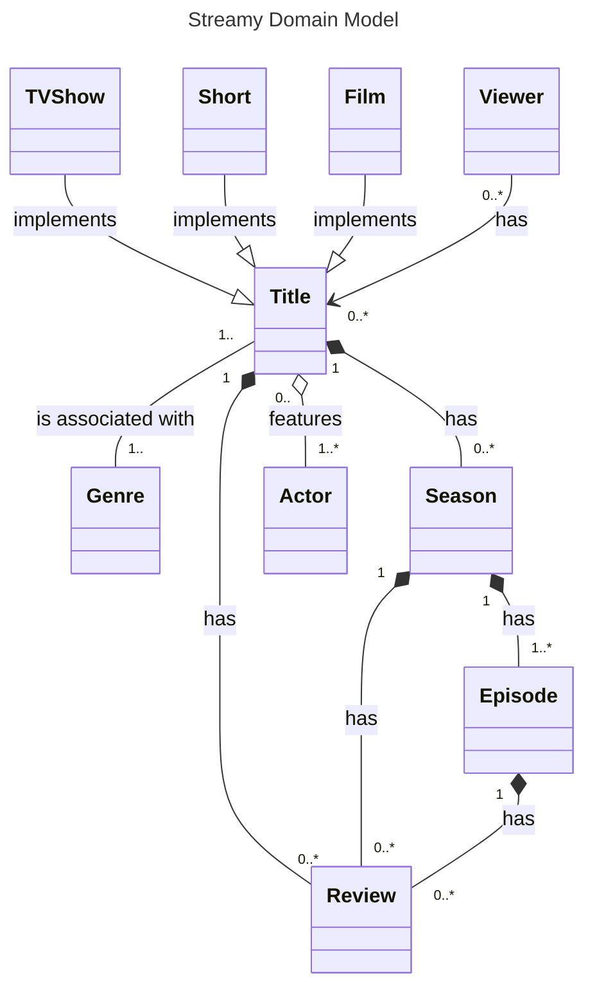
```mermaid
---
title: Streamy Domain Model
---
classDiagram
    Title "1.."--"1.." Genre:is associated with
    Title "1"*--"0..*" Season: has
    Title "1"*--"0..*" Review: has
    Title "0.."o--"1..*" Actor: features
    
    TV Show --|> Title: implements
    Short --|> Title: implements
    Film --|> Title: implements
    
    Viewer "0..*"-->"0..*" Title: has
    Season "1"*--"0..*" Review: has
    Season "1"*--"1..*" Episode: has
    Episode "1"*--"0..*" Review: has
```

### Enhancing MovieBooker
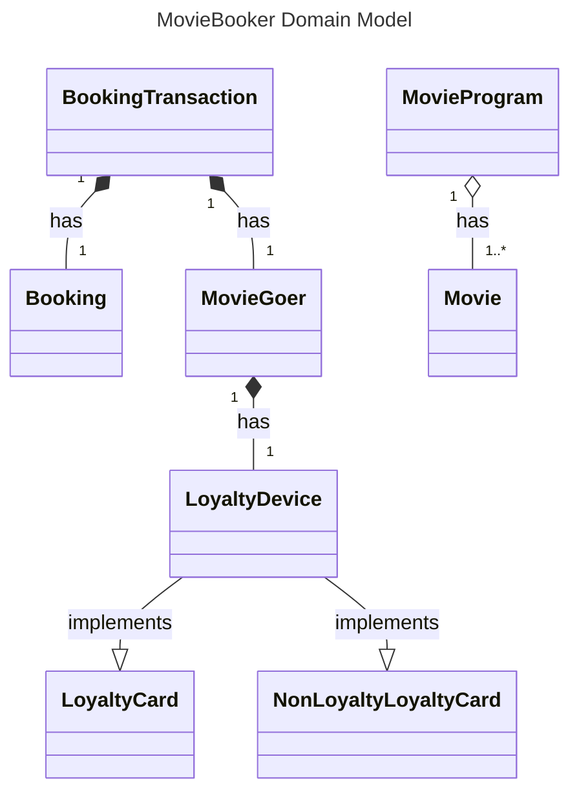
```mermaid
---
title: MovieBooker Domain Model
---
classDiagram
    BookingTransaction "1"*--"1" Booking: has
    BookingTransaction "1"*--"1" MovieGoer: has
    MovieGoer "1"*--"1" LoyaltyDevice: has
    LoyaltyDevice --|> LoyaltyCard: implements
    LoyaltyDevice --|> NonLoyaltyLoyaltyCard: implements
    MovieProgram "1"o--"1..*" Movie: has
```

#### Visualize Application and User Flows
We can use sequence diagrams to describe the flow we are expecting to build to other engineers
or even nontechnical colleagues, such as product managers. Sequence diagrams can be useful when getting
approval for buiding brand-new systems. Simply presenting the sequence diagrams along with using the C4
model can be a very effective way to explain what is proposed.

All sequence diagrams must have actors and participants. An actor represents a human and a participant represents
a process:

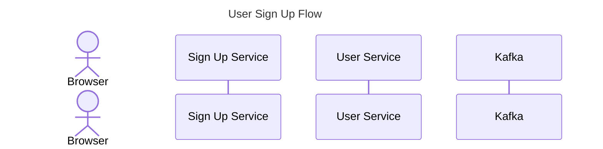
```mermaid
---
title: User Sign Up Flow
---

sequenceDiagram
    actor Browser
    participant Sign Up Service
    participant User Service
    participant Kafka
```

The above shows the nodes of the business. 

#### Our first interaction
We can now start detailing the interactions between the actors and participants.

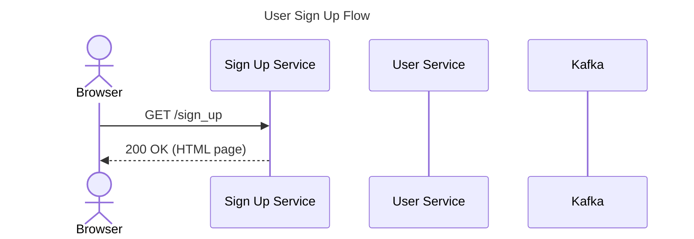
```mermaid
---
title: User Sign Up Flow
---

sequenceDiagram
    actor Browser
    participant Sign Up Service
    participant User Service
    participant Kafka
    
    Browser->>Sign Up Service: GET /sign_up
    Sign Up Service-->>Browser: 200 OK (HTML page)
```
Messages can be a variety of formats. For now we use '->>' for synchronous calls. For reply
messages we use -->> which shows a dotted line back to the initiator of the request.

#### Show Branching Logic
We can also show unhappy paths when users fail validation checks.

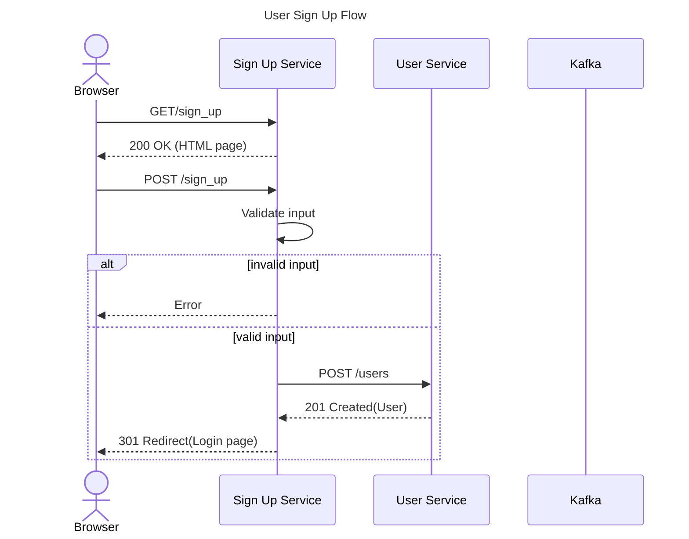
```mermaid
---
title: User Sign Up Flow
---

sequenceDiagram
    actor Browser
    participant Sign Up Service
    participant User Service
    participant Kafka
    
    Browser ->> Sign Up Service: GET/sign_up
    Sign Up Service -->> Browser: 200 OK (HTML page)
    
    Browser->>Sign Up Service: POST /sign_up
    Sign Up Service->>Sign Up Service: Validate input
    
    alt invalid input
        Sign Up Service-->>Browser: Error
    else valid input
        Sign Up Service->>User Service: POST /users
        User Service-->>Sign Up Service: 201 Created(User)
        Sign Up Service-->>Browser: 301 Redirect(Login page)
    end
```

### Display Asynchronous Messages
We can now add asynchronous messages to the UML diagram:

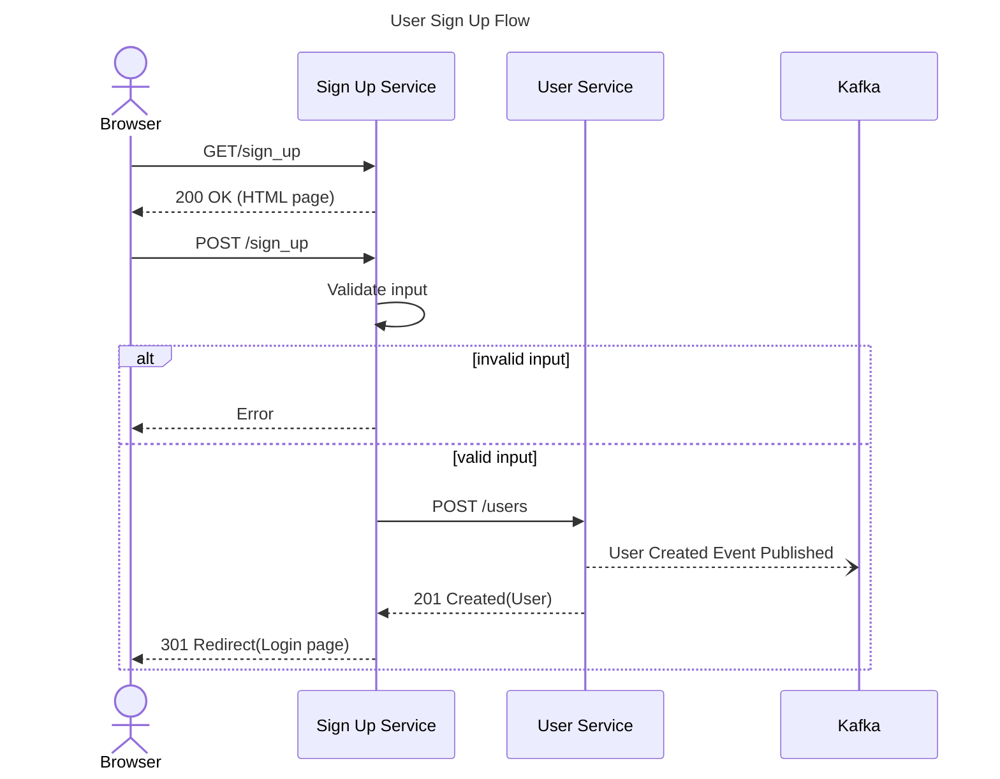
```mermaid
---
title: User Sign Up Flow
---

sequenceDiagram
    actor Browser
    participant Sign Up Service
    participant User Service
    participant Kafka
    
    Browser ->> Sign Up Service: GET/sign_up
    Sign Up Service -->> Browser: 200 OK (HTML page)
    
    Browser->>Sign Up Service: POST /sign_up
    Sign Up Service->>Sign Up Service: Validate input
    
    alt invalid input
        Sign Up Service-->>Browser: Error
    else valid input
        Sign Up Service->>User Service: POST /users
        User Service--)Kafka: User Created Event Published
        User Service-->>Sign Up Service: 201 Created(User)
        Sign Up Service-->>Browser: 301 Redirect(Login page)
    end
```

### Display Length of Interactions with Activations
We can now make the interactions even clearer with activations which show a rectangle for the start and
end of the request:
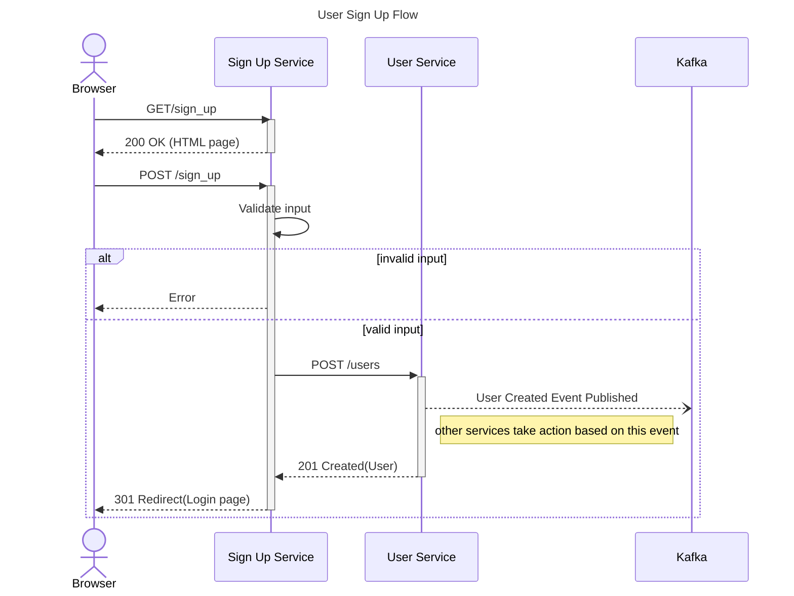
```mermaid
---
title: User Sign Up Flow
---

sequenceDiagram
    actor Browser
    participant Sign Up Service
    participant User Service
    participant Kafka
    
    Browser->>Sign Up Service: GET/sign_up
    activate Sign Up Service
    Sign Up Service-->>Browser: 200 OK (HTML page)
    deactivate Sign Up Service
    
    Browser->>+Sign Up Service: POST /sign_up
    Sign Up Service->>Sign Up Service: Validate input
    
    alt invalid input
        Sign Up Service-->>Browser: Error
    else valid input
        Sign Up Service->>+User Service: POST /users
        User Service--)Kafka: User Created Event Published
        Note left of Kafka: other services take action based on this event
        User Service-->>-Sign Up Service: 201 Created(User)
        Sign Up Service-->>-Browser: 301 Redirect(Login page)
    end
```

We can add the activation with "activation" or "+" or "-". Here we have also added a note to the Kafka event.
We can also annotate the sequence diagram with numbers for further clarity and adddrop down menus to link to a services repository,
domain model or documentation for why the service was created such as an architecture decision record. These only work on rendered
pages.

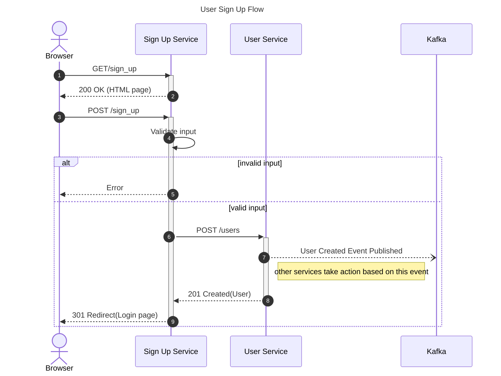
```mermaid
---
title: User Sign Up Flow
---

sequenceDiagram
    autonumber
    actor Browser
    participant Sign Up Service
    participant User Service
    participant Kafka
    
    Browser->>Sign Up Service: GET/sign_up
    activate Sign Up Service
    Sign Up Service-->>Browser: 200 OK (HTML page)
    links User Service:{"Repository": "https://www.example.com/repository"}
    deactivate Sign Up Service
    
    Browser->>+Sign Up Service: POST /sign_up
    Sign Up Service->>Sign Up Service: Validate input
    
    alt invalid input
        Sign Up Service-->>Browser: Error
    else valid input
        Sign Up Service->>+User Service: POST /users
        User Service--)Kafka: User Created Event Published
        Note left of Kafka: other services take action based on this event
        User Service-->>-Sign Up Service: 201 Created(User)
        Sign Up Service-->>-Browser: 301 Redirect(Login page)
    end
```

#### Model Your Architecture

We want to do enough design up front to validate our approach but not so much that there's no room for the
design to evolve over time. The flexibility of Mermaid ensures taht we can iterate over diagrams by changing
simple definitions. This can reduce the pain of changing diagrams that have taken a long time to create. You can even
live edit diagrams because it is just a matter of changing syntax.

#### Using the C4 Model
The C4 diagram has four parts:
- System Context
- Container
- Component
- Code

For the moment we will focus on the first three parts of the C4 diagram. There are three main elements to the System Context
diagram:
- people
- Your software system (that you are designing)
- Supporting software systems

We will start by adding Nodes:

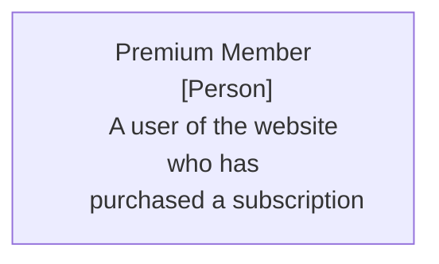
```mermaid
flowchart TD
    User["Premium Member
    [Person]
    A user of the website who has
    purchased a subscription"]
```

There are various options for the direction of the flowchart:
- TB: top-to-bottom
- TD: top-down
- BT: bottom-to-top
- RL: right-to-left
- LR: left-to-right

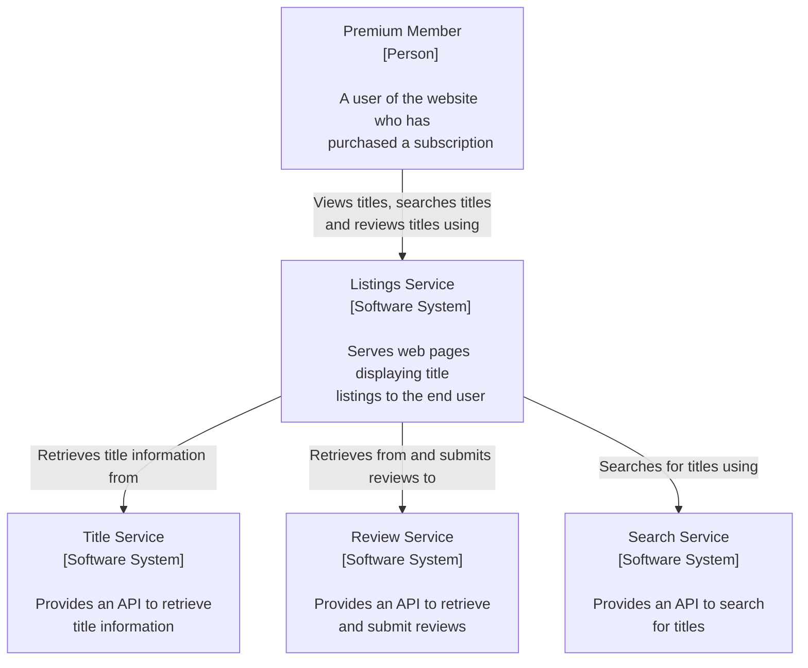
```mermaid
flowchart TD
    User["Premium Member
    [Person]
    
    A user of the website who has
    purchased a subscription"]
    
    LS["Listings Service
    [Software System]
    
    Serves web pages displaying title
    listings to the end user"]
    
    TS["Title Service
    [Software System]
    
    Provides an API to retrieve
    title information"]
    
    RS["Review Service
    [Software System]
    
    Provides an API to retrieve
    and submit reviews"]
    
    SS["Search Service
    [Software System]
    
    Provides an API to search
    for titles"]
    
    User--"Views titles, searches titles\nand reviews titles using" --> LS
    
    LS--"Retrieves title information from"-->TS
    LS--"Retrieves from and submits reviews to"-->RS
    LS--"Searches for titles using"-->SS
```

#### Adding Style

We can now add style to the nodes:

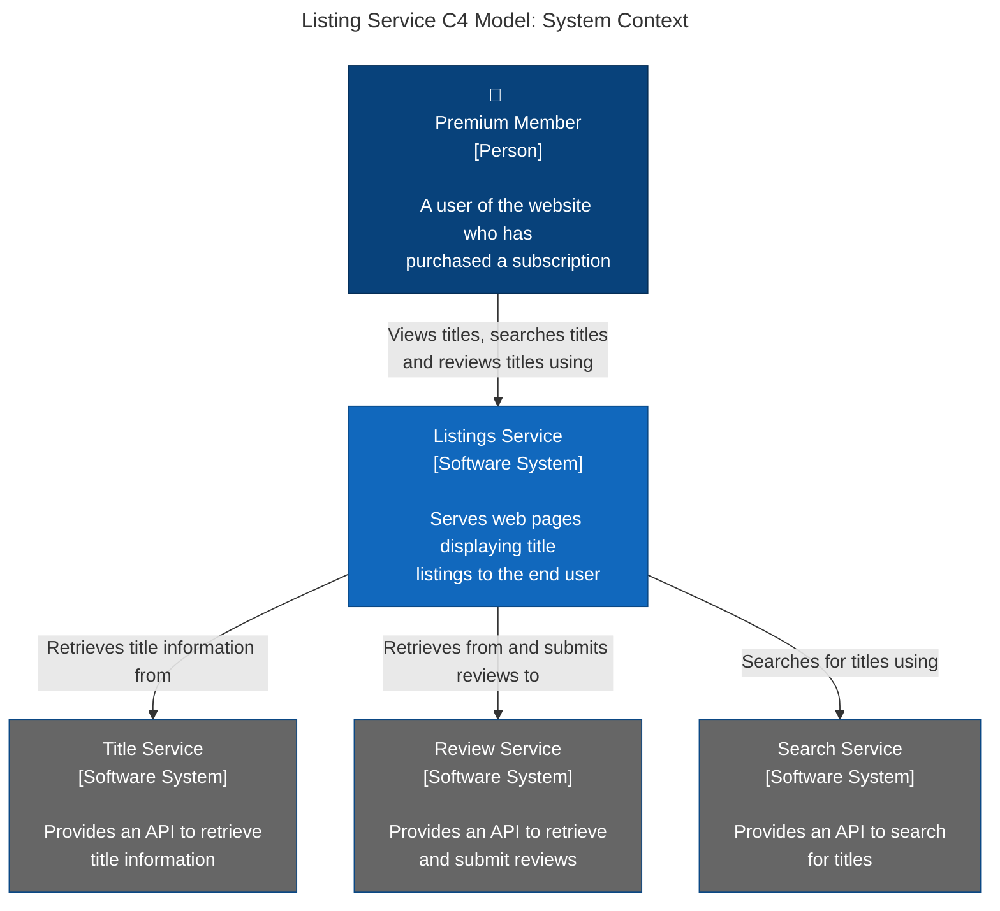
```mermaid
---
title: "Listing Service C4 Model: System Context"
---
flowchart TD
    User["🧍 
    Premium Member
    [Person]
    
    A user of the website who has
    purchased a subscription"]
    
    LS["Listings Service
    [Software System]
    
    Serves web pages displaying title
    listings to the end user"]
    
    TS["Title Service
    [Software System]
    
    Provides an API to retrieve
    title information"]
    
    RS["Review Service
    [Software System]
    
    Provides an API to retrieve
    and submit reviews"]
    
    SS["Search Service
    [Software System]
    
    Provides an API to search
    for titles"]
    
    User--"Views titles, searches titles\nand reviews titles using" --> LS
    
    LS--"Retrieves title information from"-->TS
    LS--"Retrieves from and submits reviews to"-->RS
    LS--"Searches for titles using"-->SS
    
    classDef focusSystem fill:#1168bd,stroke:#0b4884,color:#ffffff
    classDef supportingSystem fill:#666,stroke:#0b4884,color:#ffffff
    classDef person fill:#08427b,stroke:#052e56,color:#ffffff

    class User person
    class LS focusSystem
    class TS,RS,SS supportingSystem
```

#### MovieBooker System Context

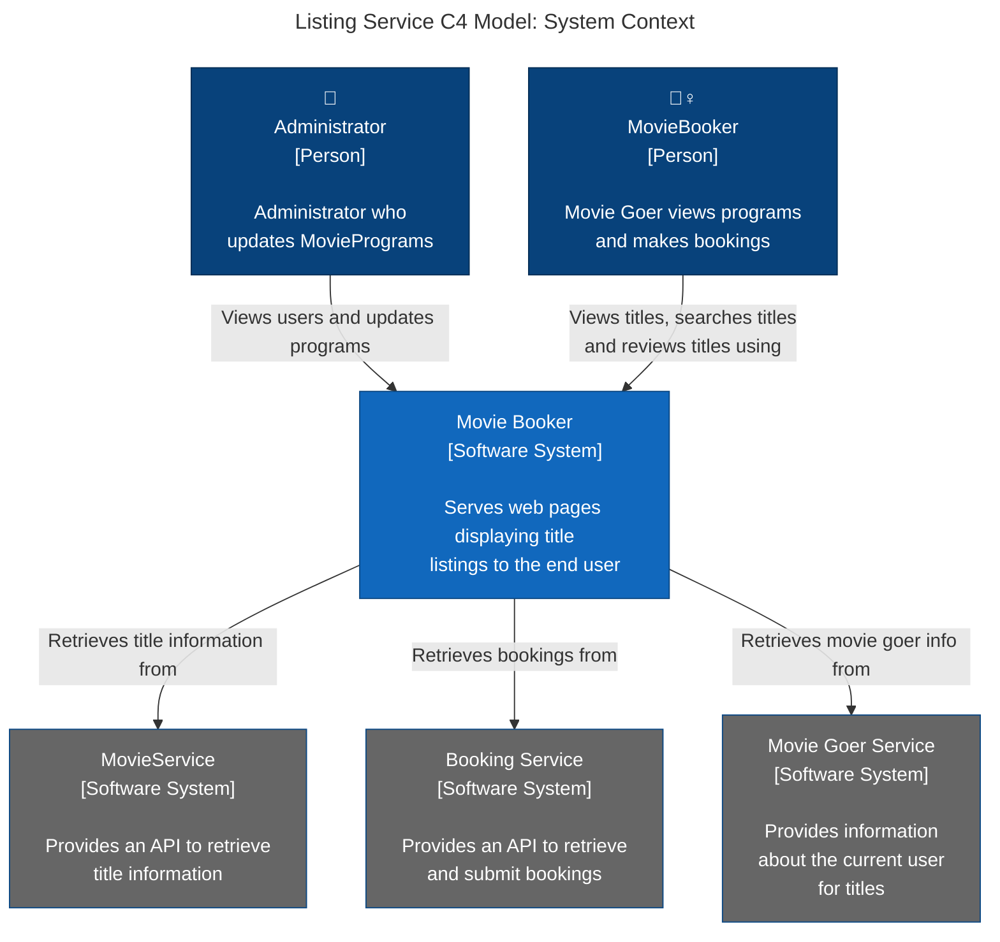
```mermaid
---
title: "Listing Service C4 Model: System Context"
---
flowchart TD
    Admin["🧍 
    Administrator
    [Person]

    Administrator who
    updates MoviePrograms"]

    User["🧍‍♀️
    MovieBooker
    [Person]
    
    Movie Goer views programs 
    and makes bookings"]
    
    MB["Movie Booker
    [Software System]
    
    Serves web pages displaying title
    listings to the end user"]
    
    MS["MovieService
    [Software System]
    
    Provides an API to retrieve
    title information"]
    
    BS["Booking Service
    [Software System]
    
    Provides an API to retrieve
    and submit bookings"]
    
    MG["Movie Goer Service
    [Software System]
    
    Provides information
    about the current user
    for titles"]
    
    Admin--"Views users and updates programs" --> MB
    User--"Views titles, searches titles\nand reviews titles using" --> MB
    
    MB--"Retrieves title information from"-->MS
    MB--"Retrieves bookings from"-->BS
    MB--"Retrieves movie goer info from"-->MG
    
    classDef focusSystem fill:#1168bd,stroke:#0b4884,color:#ffffff
    classDef supportingSystem fill:#666,stroke:#0b4884,color:#ffffff
    classDef person fill:#08427b,stroke:#052e56,color:#ffffff
    classDef admin fill:#08427b,stroke:#052e56,color:#ffffff

    class User person
    class Admin admin
    class MB focusSystem
    class MS,BS,MG supportingSystem
```

#### Detail the System's Containers

For the Container diagram, the second level of the C4 diagrams, we can talk about further detail
for the containers that are in play:
- A mobile application for mobile users
- A web application that serves web browsers and also hosts an API for the mobile app to retrieve/send data to/from
- A Redis instance for caching, to prevent repeated API calls to downstream services, such as the title service

We also have a message broker in the form of Kafka, that we send domain events to when important things happen
such as when a user views listings or a user watches a title.

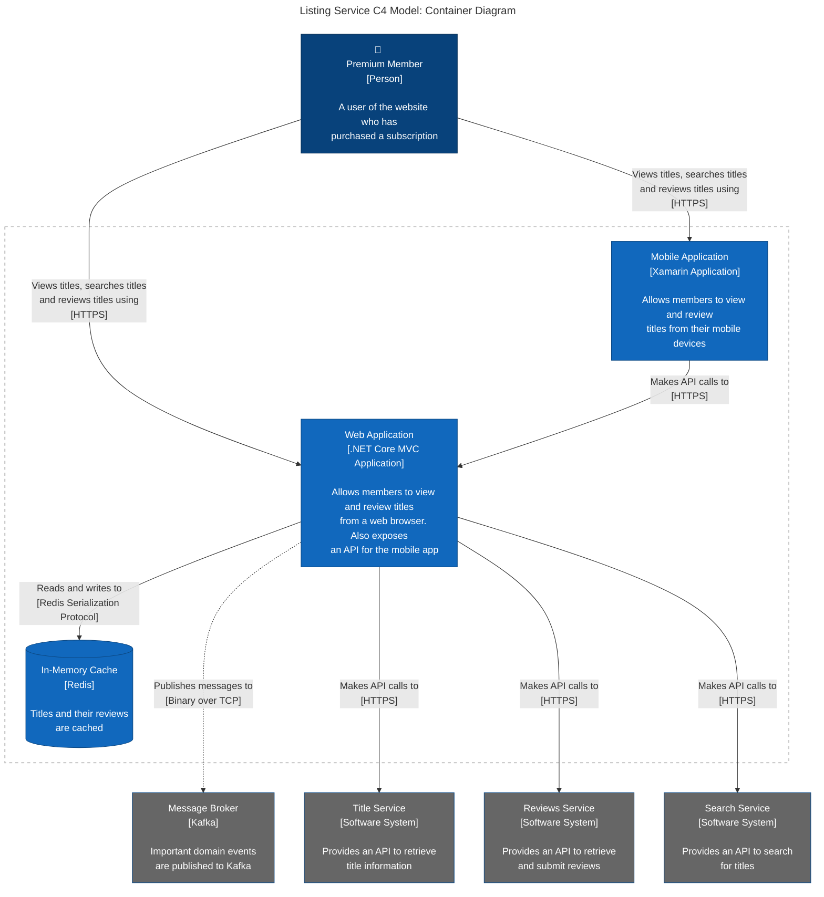
```mermaid
---
title: "Listing Service C4 Model: Container Diagram"
---
flowchart TD
    User["🧍 
    Premium Member
    [Person]
    
    A user of the website who has
    purchased a subscription"]
    
    WA["Web Application
    [.NET Core MVC Application]
    
    Allows members to view and review titles
    from a web browser. Also exposes
    an API for the mobile app"]
    
    MA["Mobile Application
    [Xamarin Application]
    
    Allows members to view and review
    titles from their mobile devices"]
    
    R[("In-Memory Cache
    [Redis]
    
    Titles and their reviews
    are cached")]
    
    K["Message Broker
    [Kafka]
    
    Important domain events
    are published to Kafka"]
    
    TS["Title Service
    [Software System]
    
    Provides an API to retrieve
    title information"]
    
    RS["Reviews Service
    [Software System]
    
    Provides an API to retrieve
    and submit reviews"]
    
    SS["Search Service
    [Software System]
    
    Provides an API to search
    for titles"]
    
    User--"Views titles, searches titles
    and reviews titles using\n[HTTPS]"-->WA
    
    User--"Views titles, searches titles
    and reviews titles using
    [HTTPS]"-->MA
    
    subgraph listing-service[Listing Service]
        WA--"Reads and writes to\n[Redis Serialization Protocol]"-->R
        MA
    end
    
    WA-."Publishes messages to\n[Binary over TCP]"..->K
    WA--"Makes API calls to\n[HTTPS]"--->TS
    WA--"Makes API calls to\n[HTTPS]"--->RS
    WA--"Makes API calls to\n[HTTPS]"--->SS
    MA--"Makes API calls to\n[HTTPS]"-->WA


    classDef container fill:#1168bd,stroke:#0b4884,color:#ffffff
    classDef person fill:#08427b,stroke:#052e56,color:#ffffff
    classDef supportingSystem fill:#666,stroke:#0b4884,color:#ffffff
    class User person
    class WA,MA,R container
    class TS,RS,SS,K supportingSystem
    style listing-service fill:none,stroke:#CCC,stroke-width:2px
    style listing-service color:#fff,stroke-dasharray: 5 5
    
```
This is a list of arrow types for mermaid diagrams:


#### Component diagrams
Often the System Context and the Container diagram are enough in terms of higher level architectural detail.
However, it can be useful at times to create a component diagram.

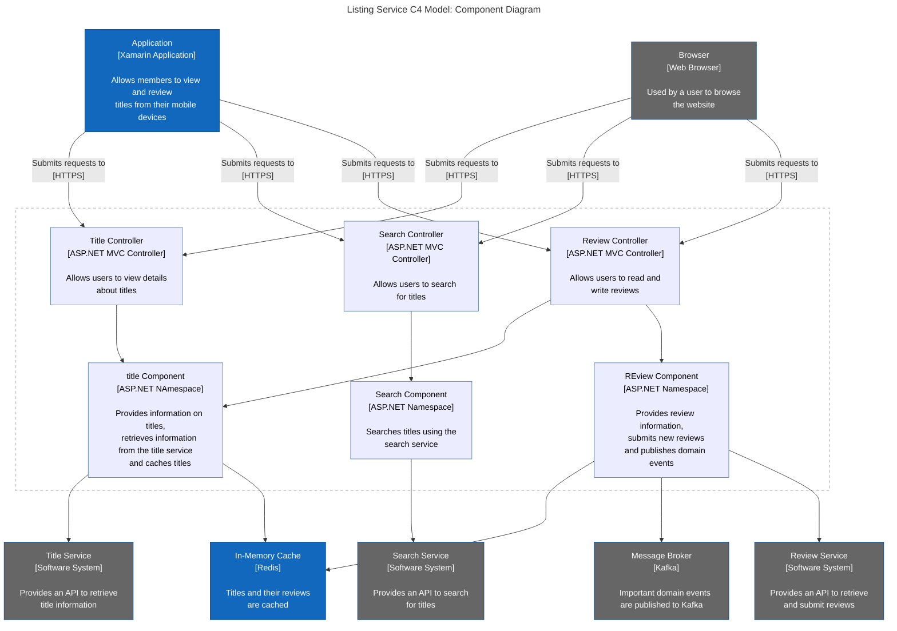
```mermaid
---
title: "Listing Service C4 Model: Component Diagram"
---

flowchart
    classDef container fill:#1168bd,stroke:#0b4884,color:#ffffff
    classDef externalSystem fill:#666,stroke:#0b4884,color:#ffffff
    classDef component fill:#855bbf0,stroke:#5d82a8,color:#000000
    
    Browser["Browser
    [Web Browser]
    
    Used by a user to browse
    the website"]
    
    MA["Application
    [Xamarin Application]
    
    Allows members to view and review
    titles from their mobile devices"]
    
    R["In-Memory Cache
    [Redis]
    
    Titles and their reviews
    are cached"]
    
    K["Message Broker
    [Kafka]
    
    Important domain events are published to Kafka"]
    
    TS["Title Service
    [Software System]
    
    Provides an API to retrieve
    title information
    "]
    
    RS["Review Service
    [Software System]
    
    Provides an API to retrieve
    and submit reviews"]
    
    SS["Search Service
    [Software System]
    
    Provides an API to search
    for titles"]
    
    TCont["Title Controller
    [ASP.NET MVC Controller]
    
    Allows users to view details
    about titles"]
    
    SCont["Search Controller
    [ASP.NET MVC Controller]
    
    Allows users to search for titles"]
    
    RCont["Review Controller
    [ASP.NET MVC Controller]
    
    Allows users to read and
    write reviews"]
    
    TComp["title Component
    [ASP.NET NAmespace]
    
    Provides information on titles,
    retrieves information from the title service
    and caches titles"]
    
    SComp["Search Component
    [ASP.NET Namespace]
    
    Searches titles using the
    search service"]
    
    RComp["REview Component
    [ASP.NET Namespace]
    
    Provides review information,
    submits new reviews
    and publishes domain events"]
    
    Browser--"Submits requests to\n[HTTPS]"--->TCont
    MA--"Submits requests to\n[HTTPS]"--->TCont
    
    MA--"Submits requests to\n[HTTPS]"--->SCont
    Browser--"Submits requests to\n[HTTPS]"--->SCont
    
    MA--"Submits requests to\n[HTTPS]"--->RCont
    Browser--"Submits requests to\n[HTTPS]"--->RCont
    
    
    subgraph listing-service[Listing Service]
        TCont--->TComp
        RCont--->TComp
        RCont--->RComp
        
        SCont--->SComp
    end
    
    TComp--->TS
    TComp--->R
    
    RComp--->R
    RComp--->K
    RComp--->RS
    
    SComp--->SS
    
    class MA,R container
    class SS,RS,TS,K,Browser externalSystem
    class RComp,SComp,TComp,RCont,SCont,TCont component
    style listing-service fill:none,stroke:#CCC,stroke-width:2px
    style listing-service color:#fff,stroke-dasharray:5 5
```

#### Database Schemas

It can be helpful to draw an ERD to model parts of the Database. On smaller databases
it is actually very easy to export the ERD from your database but
on larger databases it may help to sketch the relationships for a small part of the database
when seeking to understand relationships.

```mermaid
---
title: Streamy Entity Relationship Diagram
---

erDiagram
    TITLE {
        int title_id PK
        int type_id FK
        string name
        datetime release_date
    }
    
    TITLE_TYPE {
        int type_id PK
        string type
    }
    
    ACTOR {
        int actor_id PK
        string name
        date date_of_birth
    }
    
    TITLE_ACTOR {
        int title_id PK "FK"
        int actor_id PK "FK"
    }
    
    GENRE {
        int genre_id PK
        string name
    }
    
    TITLE_GENRE {
        int title_id PK "FK"
        int genre_id PK "FK"
    }
    
    EPISODE {
        int episode_id PK
        int season_id FK
        string name
        int season_number
        int episode_number
        datetime release_date
    }
    
    SEASON {
        int season_id PK
        int title_id FK
        int season_number
        date release_year
    }
    
    REVIEW {
        int review_id PK
        int title_id FK
        int episode_id FK
        int season_id FK
        string review_by
        datetime review_date
        string review_text
    }
    
    TITLE}|..|| TITLE_TYPE: has
    TITLE ||--o{ TITLE_GENRE: "belongs to"
    TITLE ||--|{ TITLE_ACTOR: features
    TITLE ||..|{SEASON: contains
    
    TITLE_GENRE}o--|| GENRE: references
    
    TITLE_ACTOR}|--|| ACTOR: references
    
    EPISODE}|..|| SEASON: contains
    
    REVIEW}o..o| TITLE: "made against"
    REVIEW}o..o| EPISODE: "made against"
    REVIEW}o..o| SEASON: "made against"
```

### Designing and refactoring code

#### Visualize Code Flows

```mermaid
---
title: POST /users Request Handling
---
sequenceDiagram
    autonumber
    
    participant UserController
    participant CreateUserService
    participant UserModel
    participant SendWelcomeEmailService
    participant Kafka
    
    UserController->>+CreateUserService: call
    CreateUserService->>UserModel:find_users_by_email
    UserModel-->>CreateUserService: array of Users
    
    loop
        CreateUserService->>CreateUserService:check_active_users
    end
    
    CreateUserService->>UserModel:create_user
    UserModel-->>CreateUserService: User
    
    par
        CreateUserService->>SendWelcomeEmailService: send_welcome_email
        SendWelcomeEmailService-->>CreateUserService: boolean
    end
    
    CreateUserService-->>-UserController: User
```

#### Class Diagram

We can use class diagrams to aid with refactoring. This is the code before refactoring.

```mermaid
classDiagram
    class UserController {
        -CreateUserService_createUserService
        +UserController(CreateUserService createUserService)
        +Create(string email, string username) User
    }
    
    class CreateUserService {
        -UserModel _userModel
        -SendWelcomeEmailService _sendWelcomeEmailService
        -Kafka _kafka
        +CreateUserService(UserModel um, SendWelcomeEmailService es, Kafka k)
        +Call(string email, string username) User
        -CheckActiveUsers(List~User~users) bool
    }
    
    class UserModel {
        +FindUsersByEmail(string email) List~User~
        +CreateUser(string email, string username) User
    }
    
    class User {
        +int UserId
        +string Username
        +string Email
    }
    
    class SendWelcomeEmailService {
        +Call(User user) bool
    }
    
    class Kafka {
        +PublishUserCreatedEvent(User user) bool
    }
    
    UserController..>CreateUserRequest: depends on
    UserController..>CreateUserService: depends on
    CreateUserService..> UserModel: depends on
    UserModel..> User: depends on
    CreateUserService..>SendWelcomeEmailService: depends on
    CreateUserService..> Kafka: depends on
    
```

We can add a UserRequest object to encapsulate the email and username:

```mermaid
classDiagram
    class UserController {
        -CreateUserService_createUserService
        +UserController(CreateUserService createUserService)
        +Create(string email, string username) User
    }
    
    class CreateUserRequest {
        +string Email
        +string Username
        
        +Validate() bool
    }
    
    class CreateUserService {
        -UserModel _userModel
        -SendWelcomeEmailService _sendWelcomeEmailService
        -Kafka _kafka
        +CreateUserService(UserModel um, SendWelcomeEmailService es, Kafka k)
        +Call(CreateUserRequest createUserRequest) User
        -CheckActiveUsers(List~User~users) bool
    }
    
    class UserModel {
        +FindUsersByEmail(string email) List~User~
        +CreateUser(string email, string username) User
    }
    
    class User {
        +int UserId
        +string Username
        +string Email
    }
    
    class SendWelcomeEmailService {
        +Call(string email, string username) bool
    }
    
    class Kafka {
        +PublishUserCreatedEvent(User user) bool
    }
    
    UserController..>CreateUserRequest: depends on
    UserController..>CreateUserService: depends on
    CreateUserService..> UserModel: depends on
    UserModel..> User: depends on
    CreateUserService..>SendWelcomeEmailService: depends on
    CreateUserService..> Kafka: depends on
```

We can also create an interface for the UserService:

```mermaid
classDiagram
    class UserController {
        -ICreateUserService_createUserService
        +UserController(ICreateUserService createUserService)
        +Create(string email, string username) User
    }
    
    
    class CreateUserRequest {
        +string Email
        +string Username
        
        +Validate() bool
    }
    
    class ICreateUserService {
        <<interface>>
        +Call(CreateUserRequest createUserRequest) User
    }

    class CreateUserService {
        -UserModel _userModel
        -SendWelcomeEmailService _sendWelcomeEmailService
        -Kafka _kafka
        +CreateUserService(UserModel um, SendWelcomeEmailService es, Kafka k)
        +Call(CreateUserRequest createUserRequest) User
        -CheckActiveUsers(List~User~users) bool
    }
    
    class UserModel {
        +FindUsersByEmail(string email) List~User~
        +CreateUser(string email, string username) User
    }
    
    class User {
        +int UserId
        +string Username
        +string Email
    }
    
    class SendWelcomeEmailService {
        +Call(string email, string username) bool
    }
    
    class Kafka {
        +PublishUserCreatedEvent(User user) bool
    }
    
    UserController..>ICreateUserService: depends on
    UserController..>CreateUserRequest: depends on
    CreateUserService..|> ICreateUserService: implements
    UserController..>CreateUserService: depends on
    CreateUserService..> UserModel: depends on
    UserModel..> User: depends on
    CreateUserService..>SendWelcomeEmailService: depends on
    CreateUserService..> Kafka: depends on

```