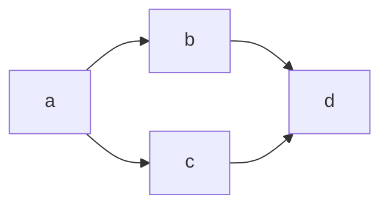
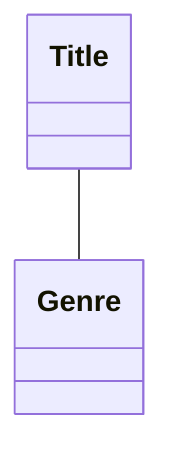
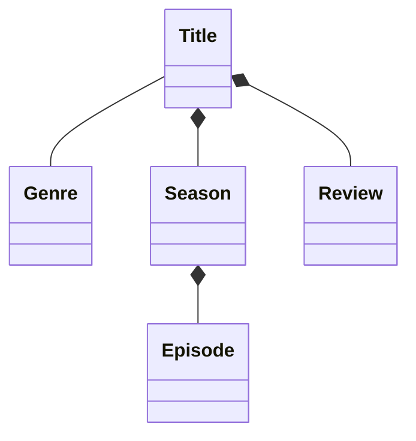
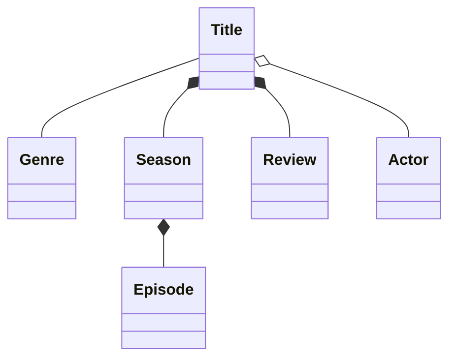
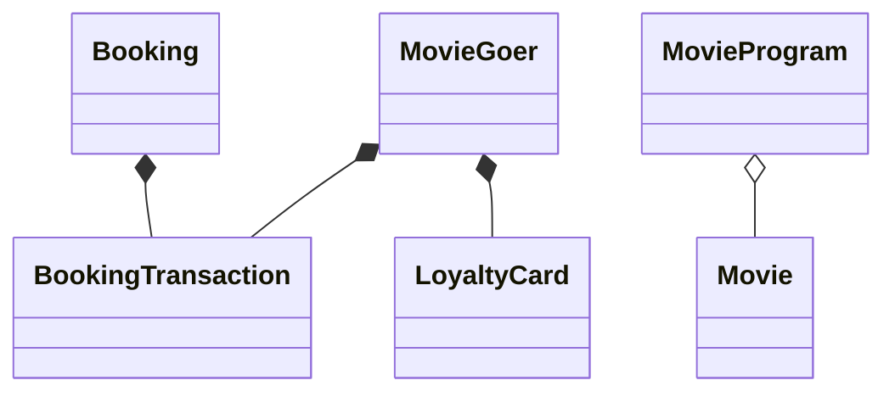
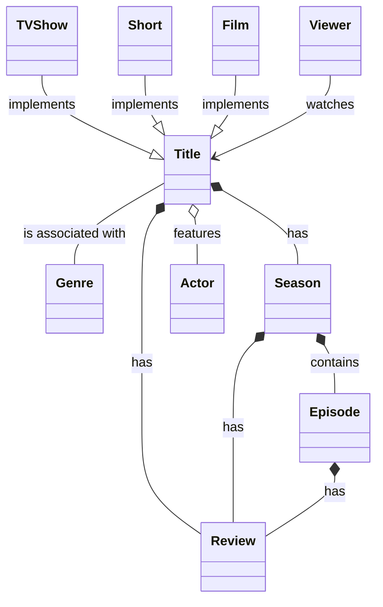
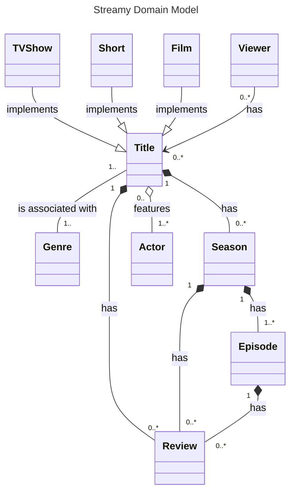
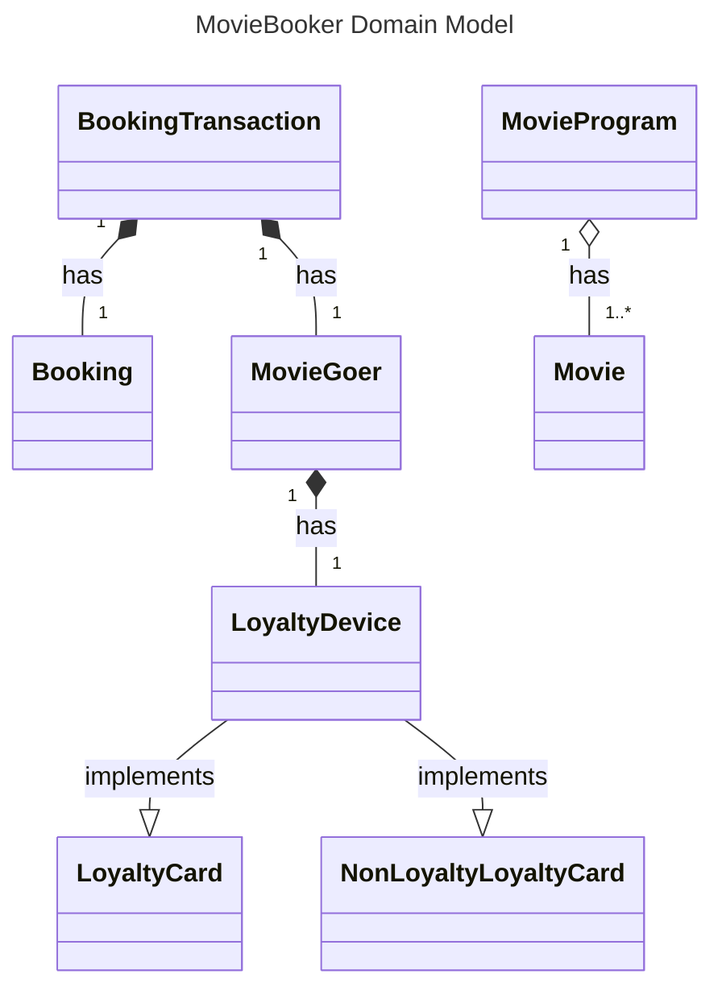

#### Mermaid cli
https://github.com/mermaid-js/mermaid-cli
```bash
npm install -g @mermaid-js/mermaid-cli
```
The syntax is quite intuitive:

Interesting you can quote the mermaid directly in markdown. You can't do this with plantuml.


There is an intellij plugin which allows viewing the image. To extract the image you need to run:
```bash
mmdc -i mermaid.mmd -o mermaid.png
```

Creating a simple class diagram is quite easy:


The relation between Title and Genre is an association which is a loose link between two entities.
We can also show a closer bond with Title that of composition:

We should put the parent on the left for easier readability. The season also has an episode which is also has a composite
relationship. This time between Episode and Season. We now know two relationship types:
- Associations: two entities that are loosely related and can exist independent of one another
- Compositions: two entities tightly related and cannot exist independently of one another

### Aggregate relationships
We can now start to think about Actors as they also provide important information about the Title.
This entity doesn't suite a composite relationship. Titles could exist without Actors and Titles without Actors.

The aggregate relationship between Actor and Title is an empty diamond. The bond between the Actor and Title is not
as strong as Season and Review so it is an aggregate relationship.

#### Associations

- Association: relationship between entities with at least one entity holding a reference to the other. 
There is no owner of the relationship and exist separately. For instance Teach and Student relationship.
- Aggregation: this is a direct relationship between entities. They do still exist independently of each other.
For instance, Teacher has an aggregate relationship to Class. You could delete the Teacher but the Class would
still remain and make sense on its own.
- Compositions: the closest relationship is reserved for compositions. Similarly to aggregations there is an owner
of the relationship. However if the parent is deleted the child must be deleted too. Grade is a composite relation to
Class. If Class were deleted the Grade wouldn't make sense unless it was linked to Class.

#### Movie Booker
We can now try to apply this to the MovieBooker domain:
https://github.dev/TomSpencerLondon/MovieBooker

We will try to improve this diagram as we progress.


### Chapter 2 Enhance the Domain Model
We will now learn how to show inheritance in order to show subtypes and how to provide more information
to anyone viewing the diagram with descriptions and multiplicity.
We can now add the TVShow, Short and Film children to Title.



### Multiplicity
We can now describe how many of one type of entity relates to another. Titles might contain one or
several seasons for instance



### Enhancing MovieBooker


